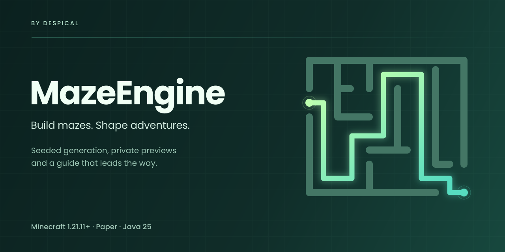

# MazeEngine

[](https://github.com/Despical/MazeEngine/actions/workflows/build.yml)


[](LICENSE)

MazeEngine creates persistent, deterministic Minecraft mazes with themed blocks, private previews and a route guide.



Read the [documentation](https://docs.despical.dev/maze-engine/) for setup instructions, configuration details and examples.

---

## Features

- Seeded PERFECT and BRAIDED generation with configurable complexity and geometry.
- Thirty bundled themes, weighted block palettes, optional roofs, lights and decorations.
- Private block-display previews with a build button and no terrain changes.
- A private arrow guide that follows the shortest route to the exit.
- Tick-budgeted world operations, chunk tickets and configurable generation limits.
- Saved layouts, ownership, safe teleport points and interrupted-operation recovery.
- SAFE, REPLACE and CLEAR placement, plus optional original-terrain snapshots.
- Clickable chat panels, permission-aware commands and configurable messages.
- Optional [WorldEdit](https://worldedit.enginehub.org/en/latest/), [FastAsyncWorldEdit](https://intellectualsites.gitbook.io/fastasyncworldedit), [WorldGuard](https://worldguard.enginehub.org/en/latest/) and [PlaceholderAPI](https://wiki.placeholderapi.com/) integrations.
- A public API registered with Bukkit's service manager.

---

## Installation

MazeEngine supports Paper 1.21.11 and newer, including 26.x. Use Java 25 to run your server and build the project. Spigot and Folia are not supported.

Build the plugin, copy `build/libs/mazeengine-1.0.0.jar` into `plugins/` and restart. Missing settings and presets are installed under `plugins/MazeEngine/`; existing files are preserved.

[WorldEdit](https://worldedit.enginehub.org/en/latest/) or [FastAsyncWorldEdit](https://intellectualsites.gitbook.io/fastasyncworldedit) is required for selections and terrain snapshots. [WorldGuard](https://worldguard.enginehub.org/en/latest/) checks region permissions during preflight and block writes when installed. [PlaceholderAPI](https://wiki.placeholderapi.com/) is optional.

---

## Getting started

```text
/maze presets
/maze preview garden 15 15 --preset Hedge --seed 42
/maze create garden
/maze tp garden
/maze solve garden
```

Move outside the preview region before building. A matching `/maze create <name>` uses the active preview's exact settings. You can also click its Build button.

Dimensions describe logical cells. Physical size depends on path width and wall thickness. The default origin is three blocks east and south of the player, with the floor one block below their feet.

---

## Commands

`/maze` and `/mazeengine` share the same command tree. `/maze help` and `/maze help concepts` provide paginated in-game reference panels.

| Command | Purpose |
| --- | --- |
| `/maze create <name> [width depth] [options]` | Generate a maze or build a matching preview. |
| `/maze preview <name> [width depth] [options]` | Preview the maze privately. |
| `/maze preview stop` | Close the active preview. |
| `/maze presets [page]` | Browse themes and click to preview. |
| `/maze list [page]` | Browse saved mazes. |
| `/maze info <name>` | Inspect geometry, seed, status and management buttons. |
| `/maze tp <name>` | Teleport to a safe saved point or the entrance. |
| `/maze solve <name> [stop]` | Open or close the route guide. |
| `/maze setspawn <name> [reset]` | Save your location or restore the entrance destination. |
| `/maze regenerate <name> [--seed <value> / --new-seed / --repair]` | Rebuild the maze or repair its non-air blocks. |
| `/maze delete <name> [--restore / --clear] [--confirm]` | Confirm deletion; restore a snapshot or clear the region. |
| `/maze cancel <name>` | Cancel the current operation. |
| `/maze reload` | Validate and reload configuration atomically. |

Creation and preview options:

| Option | Purpose |
| --- | --- |
| `--preset <name>` | Choose a preset; defaults to `default`. |
| `--seed <number>` | Reuse a signed 64-bit generation seed. |
| `--complexity <value>` | Complexity from 0.0 to 1.0. |
| `--path-width <number>` | Passage width from 1 to 16 blocks. |
| `--wall-thickness <number>` | Wall thickness from 1 to 8 blocks. |
| `--wall-height <number>` | Wall height from 2 to 64 blocks. |
| `--mode <CLEAR / SAFE / REPLACE>` | Choose terrain placement rules. |
| `--snapshot` | Save original terrain through WorldEdit before building. |
| `--selection` | Fit a centered maze inside your WorldEdit cuboid. |
| `--world <name> --x <x> --y <y> --z <z>` | Explicit origin; required from console. |

SAFE allows replaceable floor blocks and requires air above them. REPLACE checks occupied blocks against `placement.replaceable`. CLEAR overwrites the planned region. All modes check world bounds, overlap and player occupancy before mutation.

---

## Permissions

`mazeengine.admin` grants all command permissions, `mazeengine.manage.others` and `mazeengine.bypass`. Permissions default to operators.

Each command requires `mazeengine.use` and its matching permission, such as `mazeengine.create`, `mazeengine.preview` or `mazeengine.solve`. Building a preview requires `mazeengine.create`; repairing requires `mazeengine.regenerate`.

`mazeengine.manage.others` allows managing another player's maze. `mazeengine.bypass` allows player block edits in completed protected mazes. Active world operations remain protected.

---

## Configuration

- `config.yml`: performance budgets, limits, terrain protection, mob spawning, progress bars and visual settings.
- `messages.yml`: MiniMessage panels, buttons, hover text, progress labels and action bars.
- `presets/*.yml`: geometry, generation settings, palettes and decorations for each theme.

Every global setting is explained in the bundled configuration. Set `visuals.guide.block` to a colored block such as `minecraft:red_concrete` to recolor arrows. Preview and guide lifetimes, arrow size, display brightness and boss bar appearance are configurable. Defaults preserve the standard appearance.

Reload validates the complete configuration before applying it. Existing mazes retain their saved preset and topology; preset edits affect new mazes. Display lighting, view range and guide geometry update on reload. Visual lifetimes are captured when sessions start.

Mob spawning is blocked above maze footprints by default, independently of terrain protection. Existing mobs are not removed. Snapshots retain original terrain through regeneration; `delete --restore` requires the saved schematic.

---

## Public API

Import `dev.despical.mazeengine.api.MazeEngineApi` and obtain it from Bukkit:

```java
MazeEngineApi api = Bukkit.getServicesManager().load(MazeEngineApi.class);
if (api != null) {
    api.mazes().all().forEach(maze -> getLogger().info(maze.id().value()));
}
```

Call the API from the server thread. Immutable snapshots can be retained afterward. Operation handles expose progress, cancellation and completion. `MazeOperationCompletedEvent` and `MazeOperationFailedEvent` report final outcomes; `OperationKind` identifies creation, regeneration, repair or deletion.

Binary and source API JARs are included in the build. Generate API Javadocs separately as described below.

---

## PlaceholderAPI

Install [PlaceholderAPI](https://wiki.placeholderapi.com/) to use these placeholders. MazeEngine registers its expansion automatically.

| Placeholder | Value |
| --- | --- |
| `%mazeengine_count%` | Number of saved mazes. |
| `%mazeengine_preset_count%` | Number of available presets. |
| `%mazeengine_active_operations%` | Number of active maze operations. |
| `%mazeengine_owned_count%` | Number of mazes owned by the player. |
| `%mazeengine_current_<field>%` | Field from the maze the player is currently inside. |
| `%mazeengine_maze_<name>_<field>%` | Field from a named maze, for example `%mazeengine_maze_garden_theme%`. |

| Field | Value |
| --- | --- |
| `name` | Saved maze name. |
| `theme` | Preset display name. |
| `difficulty` | Easy, Medium or Hard. |
| `seed` | Generation seed. |
| `status` | Saved operation status. |
| `cells_width`, `cells_depth` | Logical grid dimensions. |
| `path_width`, `wall_thickness`, `wall_height` | Geometry in blocks. |
| `roof` | Whether the maze has a roof. |
| `route_length` | Number of cell transitions on the shortest solution route. |
| `dead_ends` | Number of dead ends. |
| `progress` | Operation progress from 0 to 100. |
| `snapshot` | Whether an original-terrain snapshot is saved. |

Current-maze and named-maze fields return empty text when no matching maze exists. Values refresh every 10 server ticks.

---

## Building

Install Java 25 and Git, then clone the repository:

```bash
git clone https://github.com/Despical/MazeEngine.git
cd MazeEngine
./gradlew clean build
```

On Windows, use the batch wrapper after cloning and entering the repository:

```cmd
gradlew.bat clean build
```

Artifacts are created under `build/libs/`. The build runs unit tests and produces the plugin, API and source JARs. Javadocs are optional.

To generate API Javadocs under `build/docs/api/`:

```bash
./gradlew apiJavadoc
```

On Windows:

```cmd
gradlew.bat apiJavadoc
```

Use `javadocJar apiJavadocJar` with either wrapper to package the full-project and API Javadocs as JARs. GitHub Actions checks the build and documentation in separate steps.

---

## Security and contributing

Report vulnerabilities privately as described in [SECURITY.md](SECURITY.md). Follow [CONTRIBUTING.md](CONTRIBUTING.md) and the [Code of Conduct](CODE_OF_CONDUCT.md).

Use four spaces, focused classes, English documentation and the existing GPL license/class Javadoc headers. Preserve gameplay and saved maze formats unless a change explicitly requires otherwise.

---

## License

MazeEngine is licensed under [GPL-3.0](LICENSE).
